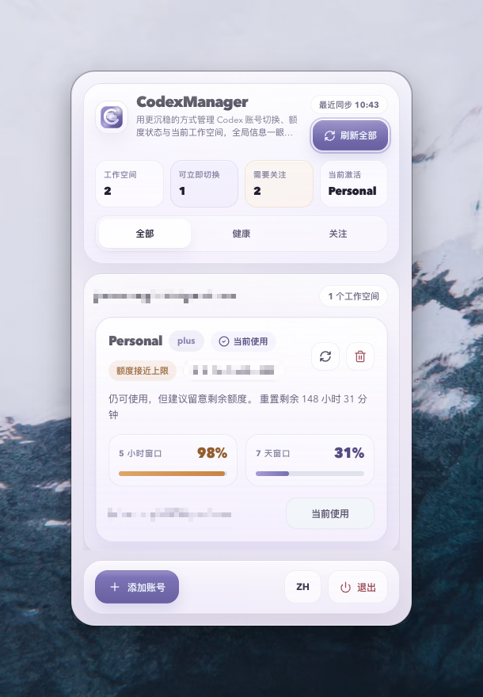

# CodexManager

一个面向 macOS 菜单栏场景的 Codex 账号管理工具，用来集中查看账号额度、切换工作空间，并在当前账号 5 小时额度耗尽时自动提示切换到可用账号。

<p align="center">
  <!-- 请将您刚刚截图的图片保存为 assets/screenshot.png 并放置于此处 -->
  
</p>

## 项目亮点

- 菜单栏形态，点击托盘即可展开主面板
- 支持 OAuth 接入 Codex / ChatGPT 账号
- 按邮箱分组管理多个工作空间
- 同时展示 5 小时窗口和 7 天窗口额度
- 支持单个账号刷新、全部刷新、当前账号切换
- 当前账号 5 小时额度耗尽时，支持自动推荐切换
- 支持“下次不再提醒”的自动切换偏好持久化
- 支持中英文界面切换
- 自定义应用图标与托盘模板图标

## 技术栈

- React 19
- TypeScript 6
- Vite 8
- Electron 41
- electron-builder
- electron-store
- axios
- lucide-react

## 当前界面能力

这个项目目前已经包含以下核心交互：

- 顶部总览区：显示工作空间总数、可立即切换数量、需要关注数量和当前激活工作空间
- 账号卡片区：显示工作空间名称、套餐、状态、额度进度、账号 ID、刷新和删除操作
- 自动切换弹窗：当当前账号 5 小时额度用尽时，询问是否切换到仍可用的账号
- 空态与筛选：支持 `全部 / 健康 / 关注` 视图切换
- 底部操作栏：支持新增账号、语言切换和退出应用

## 快速开始

### 1. 安装依赖

```bash
npm install
```

### 2. 启动开发环境

```bash
npm run dev
```

### 3. 类型检查

```bash
npx tsc --noEmit
```

### 4. 构建与打包

```bash
npm run build
```

说明：

- 构建脚本会执行 `tsc + vite build + electron-builder`
- 打包产物会输出到 `release/`
- 当前构建配置以 macOS 菜单栏应用为主

## 项目结构

```text
CodexManager/
├── assets/             # 图标、托盘资源
├── electron/           # Electron 主进程、托盘、IPC、OAuth
├── src/                # React 渲染层
│   ├── components/     # 视图组件
│   ├── constants/      # 国际化文案等常量
│   ├── hooks/          # 业务 hooks
│   ├── services/       # 接口代理封装
│   ├── utils/          # 展示与排序工具
│   └── types/          # 类型定义
├── vite.config.ts      # Vite + Electron 配置
└── package.json
```

## 关键业务流程

### 账号接入

应用通过主进程拉起 OAuth 流程，授权完成后把 token 回传到渲染层，再持久化到账户列表中。

### 账号切换

切换账号时，主进程会将目标账号 token 写入本地 Codex 认证文件，然后重启 Codex 应用完成生效。

### 额度刷新

刷新动作会请求用量接口和账户检查接口，回填：

- 工作空间名称
- 5 小时额度
- 7 天额度
- 重置时间
- 状态标签

### 自动切换

当当前激活账号的 5 小时额度达到上限时：

- 若存在可继续使用的账号，则弹出确认切换提示
- 用户可勾选“下次不再提醒”
- 若没有可用账号，则弹出不可切换提示

## 开发说明

- 当前项目使用 `window.require('electron')` 与 Electron 通信
- `src/` 负责 UI 与状态编排
- `electron/` 负责托盘、窗口、IPC、OAuth 和本地存储
- 上传 GitHub 时不需要提交 `node_modules/`、`dist/`、`dist-electron/`、`release/`

## 注意事项

- 当前应用偏向 macOS 菜单栏使用场景
- 仓库里不要提交个人账号 token、OAuth 返回结果或本地缓存文件
- 如果后续准备开源，建议再补充 `LICENSE`
