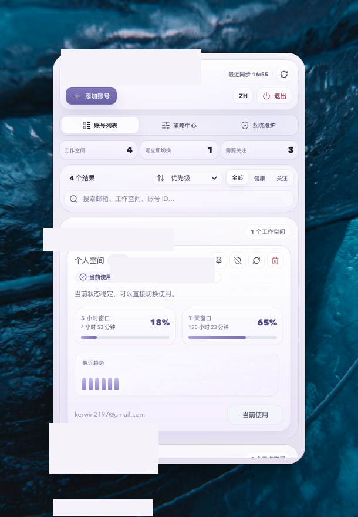
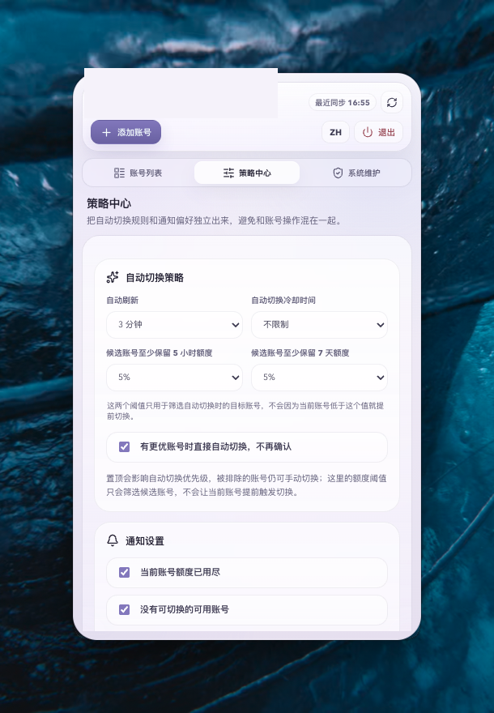
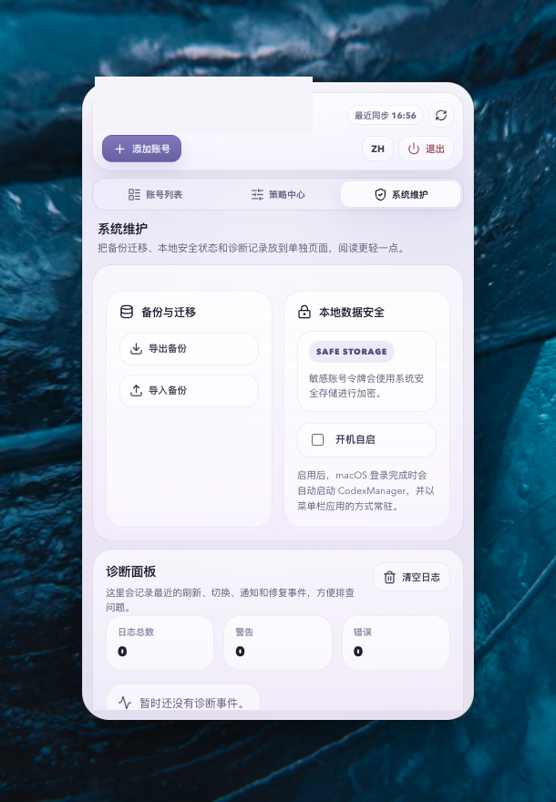

# CodexManager

一个面向 macOS 菜单栏场景的 Codex 账号管理工具，用来集中管理多个 Codex / ChatGPT 账号、查看 5 小时与 7 天额度，并在当前账号不可继续使用时自动推荐或切换到可用账号。

> `README` 中的界面截图已经做过脱敏处理，邮箱、账号 ID 等隐私信息均已遮挡。

## 界面预览

<table>
  <tr>
    <td align="center"><strong>账号列表</strong></td>
    <td align="center"><strong>策略中心</strong></td>
    <td align="center"><strong>系统维护</strong></td>
  </tr>
  <tr>
    <td align="center"></td>
    <td align="center"></td>
    <td align="center"></td>
  </tr>
</table>

## 核心能力

- 菜单栏常驻形态，点击托盘即可展开主面板
- 通过 OAuth 接入多个 Codex / ChatGPT 账号
- 按邮箱分组管理多个工作空间，并支持搜索、筛选、排序、置顶
- 同时展示 5 小时窗口和 7 天窗口额度、重置时间与最近趋势
- 支持单账号刷新、全量刷新、修复账号、手动切换与删除账号
- 当前账号 5 小时或 7 天额度耗尽时自动触发切换判断
- 自动切换支持候选账号最低剩余额度、冷却时间、排除列表、置顶优先级和跳过确认
- 后台定时刷新额度，点击菜单栏图标展开主界面时也会自动刷新
- 支持系统通知、静默时段、自动切换确认和切换成功提醒
- 提供备份导入导出、本地安全存储、开机自启和诊断面板
- 支持中英文界面切换

## 页面说明

### 账号列表

- 查看全部工作空间的健康状态、额度进度和趋势
- 搜索邮箱、工作空间名称、账号 ID
- 手动切换、刷新、修复、置顶和排除自动切换

### 策略中心

- 配置自动刷新频率
- 配置自动切换冷却时间
- 配置候选账号至少保留的 5 小时 / 7 天剩余额度
- 配置通知开关和静默时段

补充说明：

- “候选账号至少保留额度”只用于筛选自动切换时的目标账号
- 它不会因为当前账号低于这个阈值就提前触发切换

### 系统维护

- 导出和导入本地备份
- 查看本地安全存储状态
- 配置开机自启
- 查看刷新、切换、通知和修复相关诊断日志

## 快速开始

### 1. 安装依赖

```bash
npm install
```

### 2. 启动开发环境

```bash
npm run dev
```

### 3. 类型检查

```bash
npx tsc --noEmit
```

### 4. 构建与打包

```bash
npm run build
```

说明：

- `npm run dev` 会启动 Vite 开发服务
- `npm run build` 会执行 `tsc + vite build + electron-builder`
- 打包产物会输出到 `release/`
- 当前构建配置以 macOS 菜单栏应用为主

## 技术栈

- React 19
- TypeScript
- Vite
- Electron
- electron-builder
- electron-store
- axios
- lucide-react

## 项目结构

```text
CodexManager/
├── assets/             # 图标、托盘图、README 截图
│   └── readme/         # README 使用的脱敏截图
├── electron/           # 主进程、托盘、IPC、OAuth、本地存储
├── src/                # React 渲染层
│   ├── components/     # 页面组件
│   ├── constants/      # 国际化文案等常量
│   ├── hooks/          # 业务 hooks
│   ├── services/       # API 请求封装
│   ├── utils/          # 展示、排序、额度计算工具
│   └── types/          # 类型定义
├── dist/               # 前端构建产物
├── dist-electron/      # Electron 构建产物
├── release/            # 打包输出目录
├── vite.config.ts
└── package.json
```

## 关键流程

### 账号接入

应用通过主进程拉起 OAuth 授权流程，授权成功后把 token 回传到渲染层，并持久化到本地账号列表。

### 账号切换

切换账号时，主进程会把目标账号 token 写入本地 Codex 认证文件，然后重启真正的 `Codex.app` 使配置立即生效。

### 额度刷新

刷新时会请求用量接口和账户检查接口，回填：

- 工作空间名称
- 5 小时额度
- 7 天额度
- 重置时间
- 健康状态

### 自动切换

当当前激活账号的 5 小时或 7 天额度耗尽时：

- 若存在满足策略条件的候选账号，则发送系统通知并可确认切换
- 若已启用“跳过确认”，则直接自动切换到当前最优候选账号
- 若没有可用候选账号，则发送不可切换提醒

## 开发说明

- 渲染层通过 `preload` 暴露的 `window.codexAPI` 与主进程通信
- 主进程负责托盘、窗口、IPC、OAuth、登录项与本地安全存储
- 开发环境下可使用 `F12` 打开 DevTools
- 应用首次读取安全存储时，macOS 可能会弹出钥匙串授权提示

## 注意事项

- 当前项目主要面向 macOS 菜单栏场景
- 仓库里不要提交账号 token、OAuth 返回结果或本地缓存文件
- 如果后续准备开源，建议补充 `LICENSE` 和 CI 工作流
